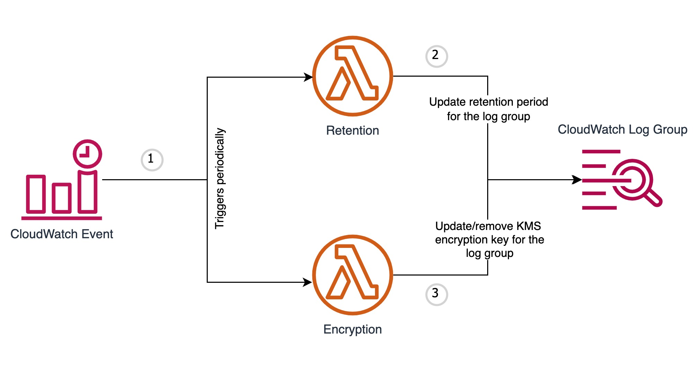

## aws-cw-log-group-manager

   

### Prerequisites:
- [Terraform](https://www.terraform.io/downloads.html)
- [AWS CLI](https://aws.amazon.com/cli/)

### AWS Services Managed:
- CloudWatch Log Group

### Supported Operations:
- Update retention period
- Update/remove KMS key

### Logic Flow:

### Setup:
- Use the [terraform module](terraform) included in this repo to create all the AWS resources required to automate IAM key rotation
